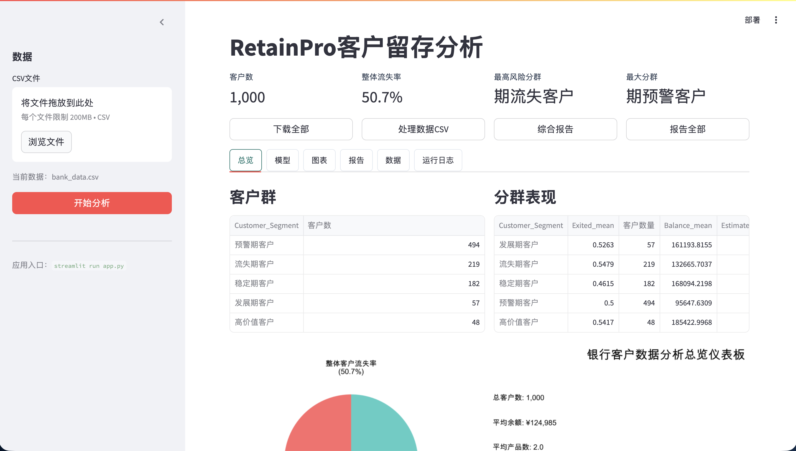
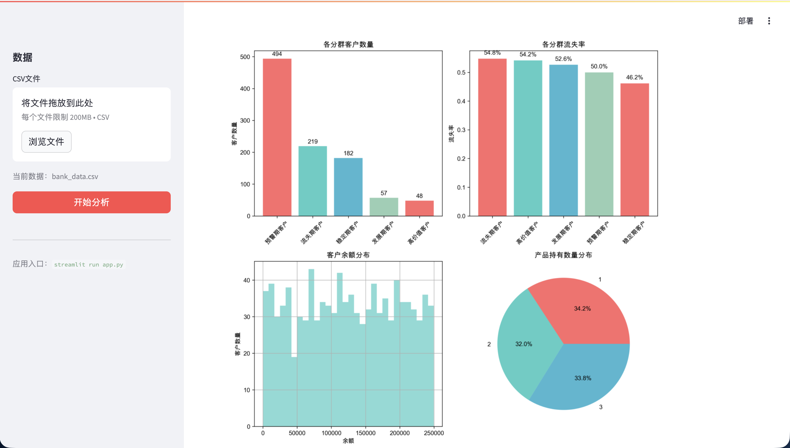
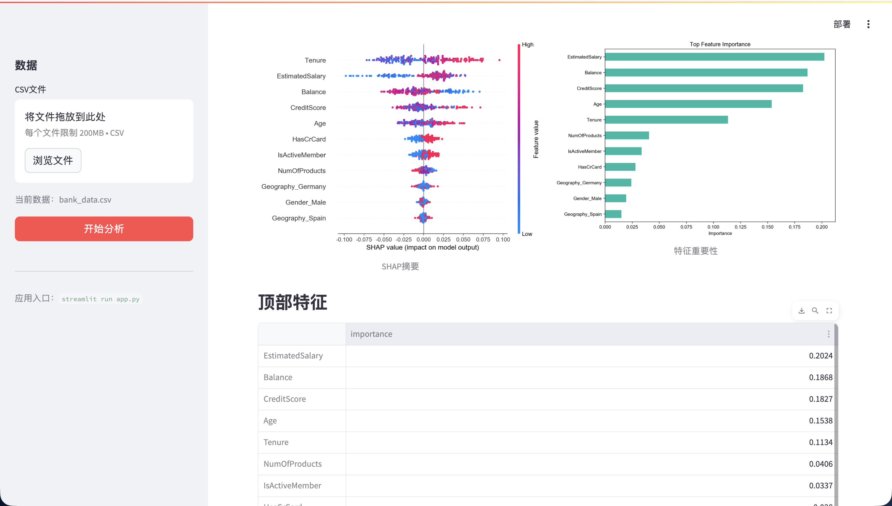

# RetainPro: AI Customer Churn Prediction System

## 🚀 Overview
AI-powered system for predicting customer churn and generating retention strategies in banking.

## 🔥 Key Features
- Machine learning churn prediction (AUC-based evaluation)
- RFM customer segmentation
- SHAP explainability
- Strategy recommendation engine
- Streamlit interactive dashboard

## 🧠 Model
- Algorithm: Random Forest / XGBoost
- Metric: ROC-AUC
- Explainability: SHAP

## 📊 Demo

## 📈 Results
- ROC-AUC: 0.85+
- SHAP analysis shows key drivers of churn

## 💼 Business Impact
- Identify high-risk users
- Optimize retention strategy
- Improve customer lifetime value

## 🛠 Tech Stack
- Python, Pandas, Scikit-learn, Streamlit
